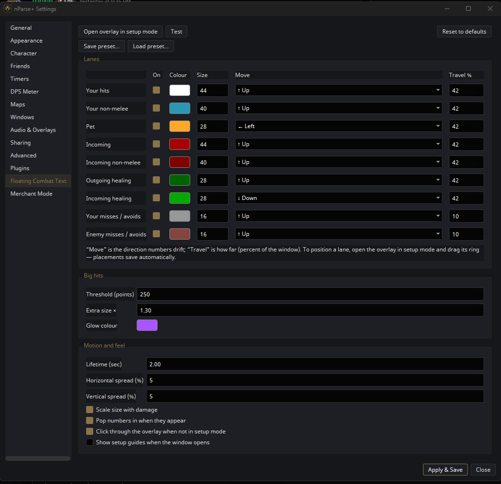
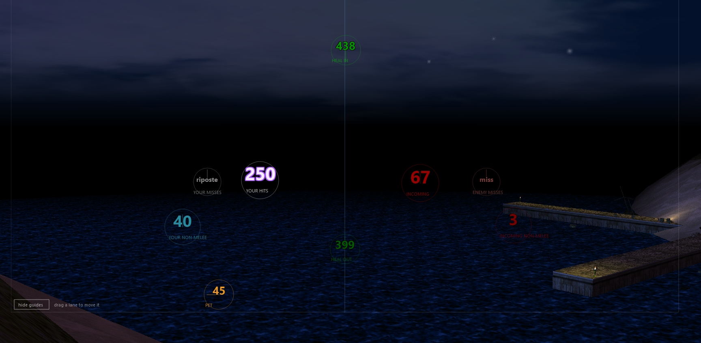
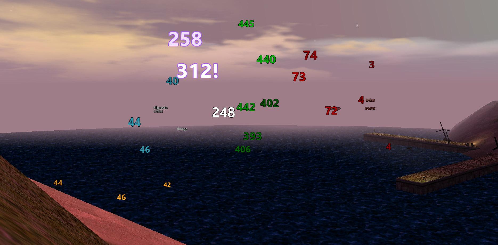

# Floating Combat Text

MMO-style floating combat text for [nParse+](https://github.com/prokopto-dev/nparse-plus),
the EverQuest Project 1999 overlay. Your hits, your pet, incoming damage,
non-melee / damage-shields, and healing appear as colour-coded numbers that
pop, drift in a direction you choose, and fade.

It reads the EQ log file only — no memory reading, no injection — and it never
sends anything anywhere.


*Every lane has its own colour, size, drift direction, and travel distance.*


*Setup mode — drag each lane's ring where you want its numbers; placements save automatically.*


*In action — white hits with a glowing `312!` crit, green heals, orange pet damage, red incoming, and miss/riposte ticks.*

## Lanes

| Lane | What it shows |
|------|---------------|
| Your hits | your melee |
| Your non-melee | your damage shield / nukes / procs (`<mob> was hit by non-melee`) |
| Pet | your pet's hits (once the pet has identified itself this session) |
| Incoming | melee damage taken |
| Incoming non-melee | a mob's damage shield / nukes on you (`You were hit by non-melee`) |
| Outgoing healing | heals you cast (`You have healed <name> for N`) |
| Incoming healing | heals cast on you (`<name> has healed you for N`) |
| Your misses / avoids | your whiffs and your dodge/parry/riposte/block (off by default) |
| Enemy misses / avoids | the mob's whiffs and its dodge/parry/riposte/block (off by default) |

Each lane has its own colour, size, on/off toggle, travel direction (8-way),
and travel distance. Big hits over a threshold get a coloured glow, and true
crits (the "scores a critical hit!" line, filtered to your character and pet)
render with a trailing `!` — `49!`. Layouts can be saved and shared as preset
JSON files (Save preset… / Load preset…). Everything is configurable in
**Settings → Floating Combat Text**.

## Install (manual)

1. In nParse+: tray icon → **Open Plugins Folder**.
2. Copy the `combat_text` folder into it.
3. Settings → **Advanced** → enable plugins, restart, and **approve**
   "Floating Combat Text" when prompted.
4. Open it from the tray menu. It starts in setup mode — drag each lane's ring
   to position it, then double-click to hide the guides.

## Install / update from the registry

If this plugin is listed on a registry you have enabled
(Settings → Plugins → Browse registry), install and update it there with one
click. Updates are also offered automatically via this repo's
[`index.json`](index.json).

## Positioning & controls

- **Open overlay in setup mode** button (in settings) — brings the overlay up
  and turns on the guides.
- Drag a lane's ring to move it; placements save automatically.
- Double-click the overlay to toggle the setup guides (only works while
  click-through is off, or from the settings button).
- When *click through when not in setup mode* is on (default), the locked
  overlay never eats clicks meant for the game.

## Data notes (P99)

- "Your non-melee" includes your damage shield **and** your nukes/procs — the
  log tags them all the same way, so they can't be split apart.
- Incoming non-melee and both healing directions are parsed straight off the
  log line, because nParse+ itself doesn't turn those into events.

## Building / validating

```bash
pip install nparseplus-sdk
nparseplus-plugin validate combat_text/
```

## License

GPL-3.0-or-later — see [LICENSE](LICENSE). Built with the GPL-3.0
`nparseplus-sdk`.

Author: BennyTwoThumbs (Forsure MyDude, EQ P99).
